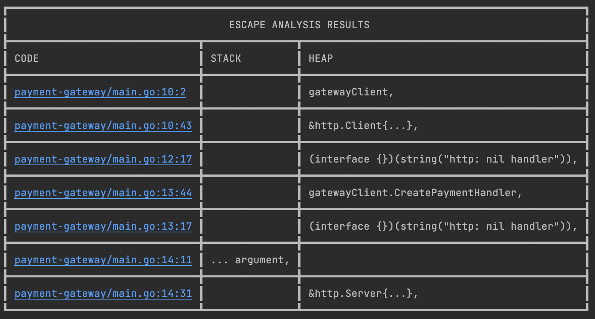

# Escape Analysis Formatter

Command line tool that translates the `go build -gcflags=-m` escape analysis results into a human-readable format to output which variables will be stored on the stack and which on the heap

### Install and Run

```
go build escape
go install escape
escape <path to package>
```

