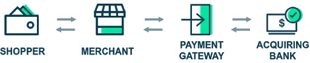

# Building a Payment Gateway

## Background

E-Commerce is experiencing exponential growth and merchants who sell their goods or services online need a way to easily
collect money from their customers.

We would like to build a payment gateway, an API based application that will allow a merchant to offer a way for their
shoppers to pay for their product.

Processing a payment online involves multiple steps and entities:

1. **Shopper**: Individual who is buying the product online.
2. **Merchant**: The seller of the product. For example, Apple or Amazon.
3. **Payment Gateway**: Responsible for validating requests, storing card information and forwarding payment requests
   and accepting payment responses to and from the acquiring bank.
4. **Acquiring Bank**: Allows us to do the actual retrieval of money from the shopper’s card and payout to the merchant.
   It also performs some validation of the card information and then sends the payment details to the appropriate 3rd
   party organization for processing.

We will be building the payment gateway only and simulating the acquiring bank component in order to allow us to fully
test the payment flow.

## Requirements

The product requirements for this initial phase are the following:

1. A merchant should be able to process a payment through the payment gateway and receive either
   a successful or unsuccessful response.
2. A merchant should be able to retrieve the details of a previously made payment. The next section
   will discuss each of these in more detail.

## Process a payment

The payment gateway will need to provide merchants with a way to process a payment. To do this, the merchant must be
able to submit a request to the payment gateway. A payment request should include appropriate fields such as the card
number, expiry month/year, amount, currency, and cvv.
